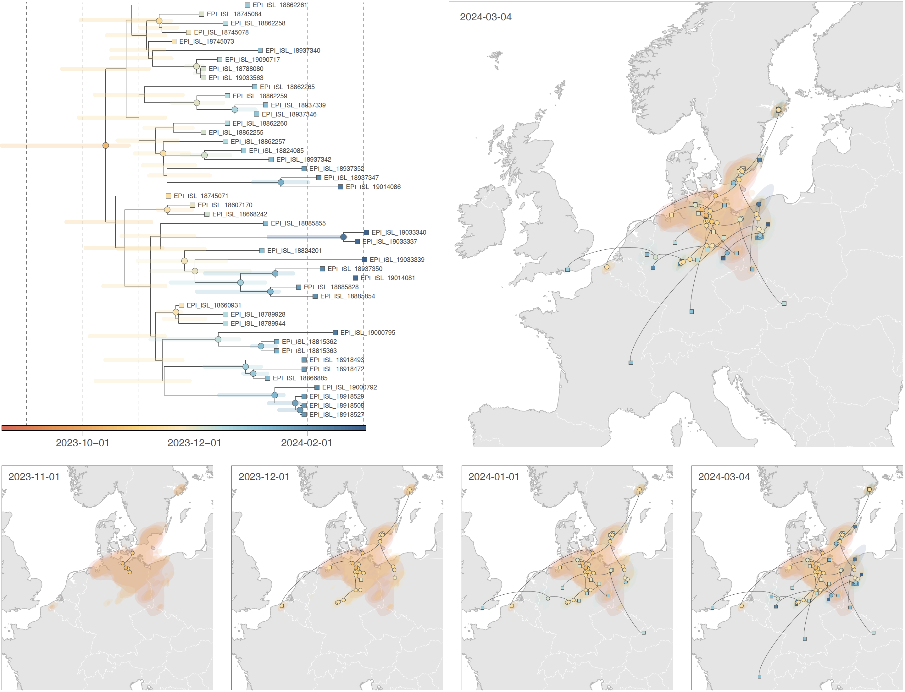

This repo gathers the input files and scripts related to our study entitled "**Tracing the genesis and spread of a novel high pathogenicity H5N1 clade 2.3.4.4b avian influenza virus reassortant genotype (EA-2023-DG) in western Europe**" (Van Borm *et al*., *submitted*). R scripts related to the analyses are all gathered within the file `R_scripts_DG.r`.

Abstract: In Europe, high pathogenicity avian influenza (HPAI) continues to circulate in avian wildlife with frequent reassortment, sporadic introductions in domestic birds and spillover to mammals. A reassortant EA-2023-DG was detected in November 2023 in western Europe, affecting both wild and domestic birds. Six of its RNA segments came from the EA-2021-AB genotype of H5 clade 2.3.4.4b but the PB2 and PA segments originated from low pathogenicity AI viruses. Discrete phylogeographic analyses of concatenated genomes as well as single PA and PB2 segments suggest a reassortment event in the fall season of 2023 near the southwestern Baltic Sea. Subsequent continuous phylogeographic analysis of all available concatenated EA-2023-DG genomes highlights circulation in northwestern Europe until June 2024 as well as long-distance dispersal towards central France, Sweden, England, and Slovakia. These results illustrate the value of phylodynamic approaches to investigate the emergence of novel avian influenza virus variants and trace their subsequent dispersal history.

**Figure: continuous phylogeographic analysis of the spread of the AIV H5N1 genotype EA-2023-DG since its emergence.**  We first report the time-scaled maximum clade credibility (MCC) tree obtained from this continuous phylogeographic inference, with horizontal line segments reflecting the 95% highest posterior density (HPD) associated with each internal node age estimate. We then map this MCC tree and 80% HPD regions reflecting the uncertainty related to the Bayesian phylogeographic inference, both for the overall period and for subsequent time points. The MCC tree and 80% HPD regions are based on 1,000 trees sampled from the posterior distribution of trees and are coloured according to their time of occurrence, with internal and tip nodes displayed as dots and squares, respectively. On the maps, the dispersal direction of viral lineages is indicated by the edge curvature (dispersal direction is anticlockwise).
